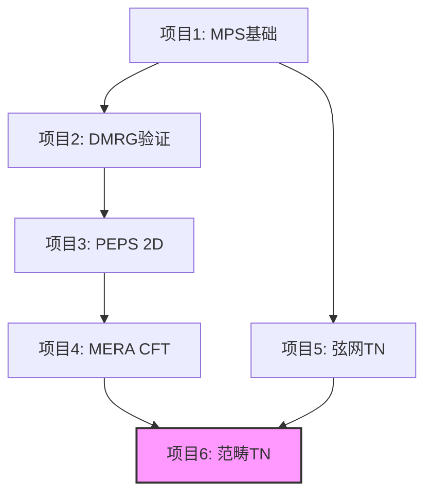

# 张量网络研究项目 (Tensor Network Research)

**适用于凝聚态物理博士研究，聚焦拓扑序、量子多体与范畴理论**

[](https://opensource.org/licenses/MIT)

## 项目概述

本研究项目系统性地探索张量网络（Tensor Network, TN）在强关联量子系统中的应用，特别是在拓扑序、弦网液体和范畴对称性方面的研究。项目包含6个渐进式、互相关联的子项目，从基础验证到前沿创新。

### 核心思想

张量网络利用**纠缠面积律**将高维希尔伯特空间压缩为**低秩张量乘积**，是理解和模拟强关联量子态的核心工具。

## 项目路线图



## 六个研究项目

### [项目1: MPS基础构建与纠缠标度律](project1_MPS_basics/) (1-2个月)
- **目标**: 掌握MPS表示，验证面积律
- **系统**: 一维横场伊辛模型
- **关键概念**: 施密特分解、冯诺依曼纠缠熵
- **产出**: 代码库 + 研究报告

### [项目2: DMRG精确求解Haldane链](project2_DMRG_Haldane/) (2-3个月)
- **目标**: 验证SPT相的边缘四重简并
- **系统**: 自旋-1 AKLT链
- **关键概念**: 拓扑保护、弦序参数
- **产出**: 组内报告 + *Physical Review B* 论文

### [项目3: PEPS模拟二维Kitaev模型](project3_PEPS_Kitaev/) (4-6个月)
- **目标**: 重现非阿贝尔任意子液体
- **系统**: Kitaev蜂窝模型
- **关键概念**: 拓扑纠缠熵、编织统计
- **产出**: *Physical Review Letters* 潜力

### [项目4: MERA提取CFT中心电荷](project4_MERA_CFT/) (3-4个月)
- **目标**: 从MERA层级提取共形场论数据
- **系统**: 一维伊辛模型临界点
- **关键概念**: 标度维度、全息对偶
- **产出**: *SciPost Physics* 论文

### [项目5: 弦网液体的TN实现](project5_StringNet/) (6-8个月)
- **目标**: 用TN编码Wen的弦网凝聚态
- **系统**: Levin-Wen模型
- **关键概念**: 融合范畴、F-符号
- **产出**: *Nature Physics* 潜力

### [项目6: 范畴对称的张量网络表示](project6_Categorical_Symmetry/) (8-12个月)
- **目标**: 将范畴对称嵌入TN，研究非可逆缺陷
- **理论基础**: 融合高阶范畴
- **关键概念**: 缺陷线、异常匹配
- **产出**: 博士论文核心章节

## 目录结构

```
ITensor-Res/
├── project1_MPS_basics/          # 项目1: MPS基础
│   ├── src/                      # 源代码
│   ├── notebooks/                # Jupyter notebooks
│   ├── docs/                     # 文档
│   └── results/                  # 结果和图表
├── project2_DMRG_Haldane/        # 项目2: DMRG
├── project3_PEPS_Kitaev/         # 项目3: PEPS
├── project4_MERA_CFT/            # 项目4: MERA
├── project5_StringNet/           # 项目5: 弦网
├── project6_Categorical_Symmetry/# 项目6: 范畴对称
├── common/                       # 共享工具和实用函数
│   ├── utils/                    # 通用工具
│   ├── visualization/            # 可视化工具
│   └── benchmarks/               # 性能测试
├── docs/                         # 总体文档
│   ├── papers/                   # 论文草稿
│   ├── presentations/            # 演讲材料
│   └── notes/                    # 研究笔记
└── scripts/                      # 安装和设置脚本
```

## 工具链

| 阶段 | 工具 | 用途 |
|------|------|------|
| 入门 | **TeNPy** | 教学，MPS/DMRG |
| 中级 | **ITensor** (C++/Julia) | 高性能，对称性 |
| 进阶 | **Quimb** | PEPS，GPU加速 |
| 前沿 | **TensorNetwork + JAX** | 自动微分，MERA |

## 快速开始

### 环境设置

```bash
# 克隆仓库
git clone https://github.com/your-username/ITensor-Res.git
cd ITensor-Res

# 创建Python虚拟环境
python -m venv venv
source venv/bin/activate  # Linux/Mac
# venv\Scripts\activate  # Windows

# 安装依赖
pip install -r requirements.txt

# 安装ITensor (C++)
cd scripts
./install_itensor.sh

# 验证安装
python -c "import tenpy; print('TeNPy version:', tenpy.__version__)"
```

### 运行第一个示例

```bash
cd project1_MPS_basics/src
python mps_ising.py
```

## 时间线与产出

| 时间 | 项目 | 产出 |
|------|------|------|
| 0-3月 | 项目1 | 代码库 + 报告 |
| 3-6月 | 项目2 | 组内talk + 短文 |
| 6-12月 | 项目3 | *PRL* |
| 12-18月 | 项目4 | *SciPost* |
| 18-30月 | 项目5 | *Nature Physics* |
| 24-36月 | 项目6 | 博士论文 |

## 学习资源

### 推荐书籍
1. **"A Practical Introduction to Tensor Networks"** - Roman Orus
2. **"Tensor Network Contractions"** - Shi-Ju Ran et al.
3. **"Quantum Phase Transitions"** - Subir Sachdev

### 在线课程
- [TeNPy Tutorials](https://tenpy.readthedocs.io/)
- [ITensor Documentation](https://itensor.org/)
- [DMRG School Materials](http://www.dmrg-school.org/)

### 重要论文
- Verstraete & Cirac, *arXiv:cond-mat/0407066* (MPS/PEPS综述)
- Levin & Wen, *Phys. Rev. B 71, 045110 (2005)* (弦网)
- Vidal, *Phys. Rev. Lett. 99, 220405 (2007)* (MERA)

## 研讨会与会议

- **台湾DMRG学校** (年度)
- **Boulder School** - Quantum Information
- **TN Workshop** - Würzburg, 德国

## 贡献指南

本项目欢迎贡献！如果你：
- 发现bug或有改进建议
- 实现了新的TN算法
- 有更好的可视化方法

请提交Issue或Pull Request。

## 引用

如果本项目对你的研究有帮助，请引用：

```bibtex
@misc{itensor_res_2025,
  author = {Your Name},
  title = {Tensor Network Research for Topological Order and Quantum Many-Body Systems},
  year = {2025},
  publisher = {GitHub},
  url = {https://github.com/your-username/ITensor-Res}
}
```

## 许可证

本项目采用 MIT 许可证 - 详见 [LICENSE](LICENSE) 文件。

## 联系方式

- **研究者**: [Your Name]
- **Email**: your.email@university.edu
- **研究组**: Wen Group, Department of Physics

---

**开始你的张量网络研究之旅！** 🚀

*"The most exciting phrase to hear in science is not 'Eureka!' but 'That's funny...'"* - Isaac Asimov
